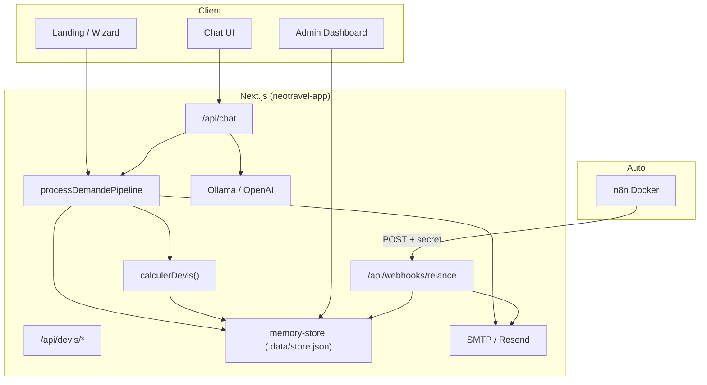

# NeoTravel App

Application Next.js — chat devis, wizard, dashboard admin, API pricing déterministe.

## Lancement

```bash
cp .env.example .env
npm install
npm run dev        # http://localhost:3000
npm run build && npm start   # production locale
```

### Prérequis optionnels

- **Ollama** (LLM local) : `ollama serve` + `ollama pull llama3.2`
- **n8n** : depuis la racine du repo, `docker compose up -d n8n`
- **Tunnel public** : `npm run tunnel` (Cloudflare → port 3000)

## Variables d'environnement

| Variable | Obligatoire | Description |
|----------|-------------|-------------|
| `LLM_PROVIDER` | Non | `ollama` (défaut) ou `openai` |
| `OLLAMA_BASE_URL` | Si Ollama | ex. `http://127.0.0.1:11434` |
| `OLLAMA_MODEL` | Si Ollama | ex. `llama3.2` |
| `OPENAI_API_KEY` | Si OpenAI | Clé API |
| `DEMO_MODE` | Recommandé | `true` — relances accélérées (minutes) |
| `WEBHOOK_SECRET` | Recommandé | Secret header `x-webhook-secret` (relances n8n) |
| `APP_BASE_URL` | Prod | URL publique (emails, liens devis) |
| `SMTP_HOST`, `SMTP_PORT`, `SMTP_USER`, `SMTP_PASS` | Email réel | Brevo / Gmail |
| `EMAIL_FROM` | Email réel | Expéditeur |
| `RESEND_API_KEY` | Alternative | API Resend à la place de SMTP |

Sans SMTP ni Resend : emails **simulés** en console (OK pour tests).

Voir [`.env.example`](.env.example) et [docs/DEPLOY-VERCEL.md](docs/DEPLOY-VERCEL.md).

## Architecture



**Règle d'or :** seul `calculerDevis()` produit un prix. Le pipeline serveur calcule avant le LLM ; le chat peut répondre via `directReply` sans inventer de montant.

## System prompt (extrait)

Fichier : `src/lib/agent/system-prompt.ts`

```
Tu es le conseiller commercial NeoTravel (autocar, groupes).

RÈGLES :
- Le client ne connaît PAS la distance, la durée ni le prix. Ne les lui demande JAMAIS.
- Tu collectes seulement : départ, arrivée, date, nombre de passagers, email (et entreprise si pro).
- Les chiffres du devis viennent du back-office (section RÉSULTAT BACK-OFFICE) : tu les recopies sans les modifier.
- Réponses courtes, chaleureuses, en français. Une seule question à la fois si info manquante.
- Ne cite jamais d'outils techniques ni "[à calculer]".

Si le back-office a fourni un devis TTC, présente-le clairement et propose l'envoi par email.
```

En runtime, le prompt est enrichi avec `RÉSULTAT BACK-OFFICE :` + hint du pipeline (`src/app/api/chat/route.ts`).

## Structure code

| Dossier | Rôle |
|---------|------|
| `src/lib/pricing/` | `calculer-devis.ts`, matrices, estimation trajet |
| `src/lib/demande-ingest.ts` | Pipeline chat + wizard |
| `src/lib/agent/` | System prompt, tools LLM |
| `src/lib/db/memory-store.ts` | Persistance + `logAction()` |
| `src/app/api/` | Routes REST |
| `e2e/` | Tests Playwright |

## Tests

```bash
npm run test:unit     # Vitest — golden pricing
npm run test:e2e      # Playwright (3 scénarios devis)
npm run test          # les deux
```

Cas détaillés : [`../docs/cas-de-test.md`](../docs/cas-de-test.md).

## Workflows & SDK

- Export n8n : [`../n8n/workflows/relance-neotravel.json`](../n8n/workflows/relance-neotravel.json)
- Agent tools : `src/lib/agent/tools.ts` (Vercel AI SDK)

## Documentation projet

Racine [`../docs/`](../docs/) — fiabilité, passation, démo soutenance, équipe, backlog.
