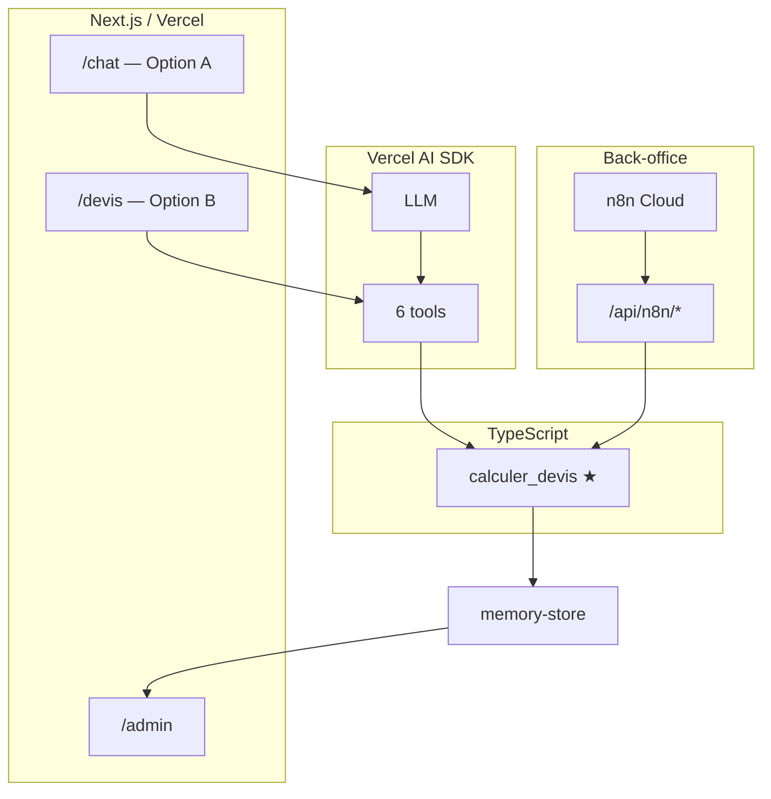
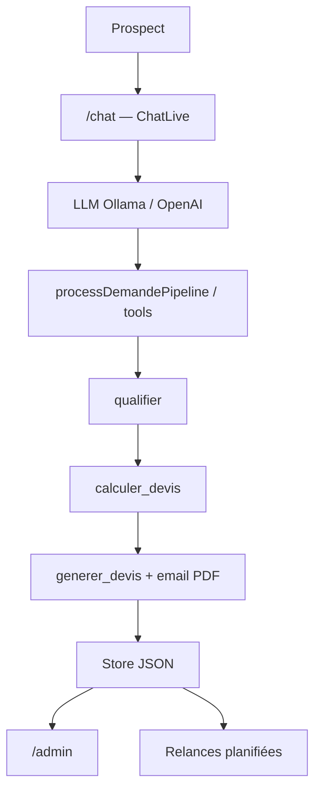
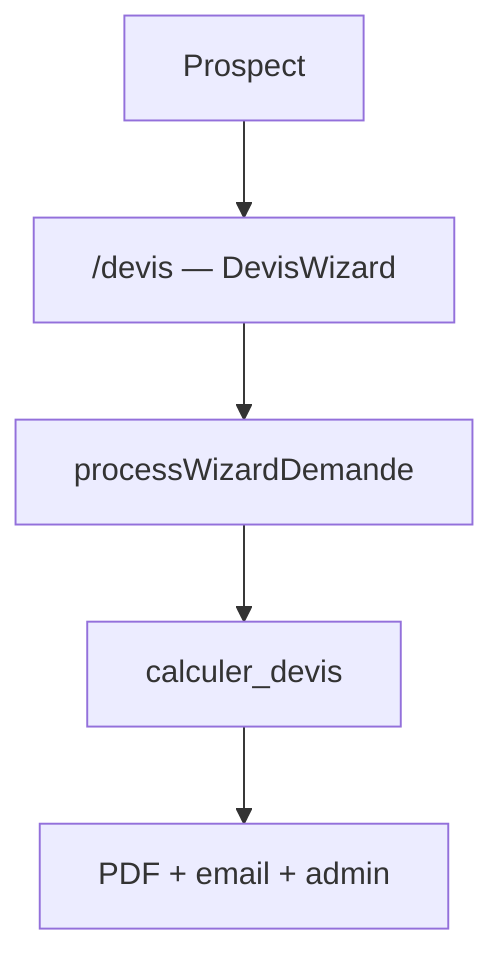
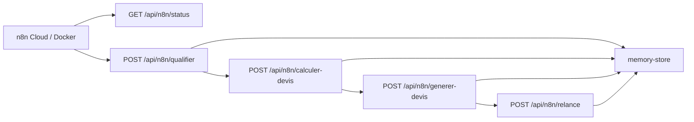

# Architecture NeoTravel

> **Documentation complète :** [`docs/mode-emploi.md`](../../docs/mode-emploi.md) — schémas, API, n8n, déploiement, FAQ soutenance.

## Nomenclature Option A / B

| Sens | Option A | Option B |
|------|----------|----------|
| **Parcours utilisateur** | `/chat` — assistant IA (principal) | `/devis` — formulaire guidé (alternatif) |
| **Architecture technique (fiche PDF)** | n8n comme cerveau (non retenu) | **Vercel AI SDK** dans Next.js (implémenté) |

## Vue d'ensemble

Deux entrées utilisateur → **un seul pipeline métier** → store JSON → admin + relances n8n.

## Flux Option A (chat)

## Flux Option B (formulaire)

## Orchestration n8n

n8n orchestre la même chaîne via REST (`x-webhook-secret`) :

Workflow : `n8n/workflows/neotravel-orchestration.json`

| Route | Rôle |
|-------|------|
| `GET /api/n8n/status` | Santé + relances en attente |
| `POST /api/n8n/qualifier` | Parse / crée demande |
| `POST /api/n8n/calculer-devis` | Moteur tarifaire déterministe |
| `POST /api/n8n/generer-devis` | Devis + PDF + email |
| `POST /api/n8n/relance` | Traite relances dues |

## Fournisseurs LLM

| Environnement | Configuration | Fournisseur |
|---------------|---------------|-------------|
| Local dev | `LLM_PROVIDER=ollama` | Ollama |
| Vercel prod | `LLM_PROVIDER=openai` + clé API | OpenAI |
| Secours | `DEMO_MODE=true` ou `/chat?demo=1` | Pipeline sans LLM |

## Règle d'or

Le LLM **ne calcule jamais le prix**. Seul `calculerDevis()` dans `src/lib/pricing/calculer-devis.ts` produit un montant. Voir [`docs/mode-emploi.md`](../../docs/mode-emploi.md#5-moteur-tarifaire).
