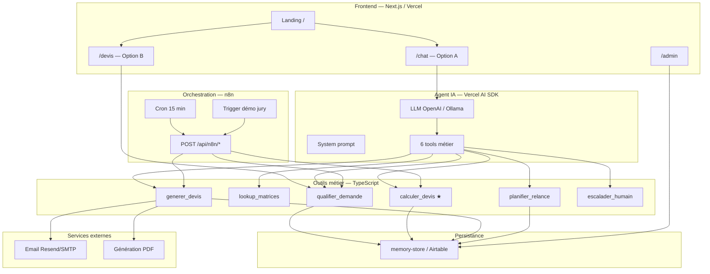
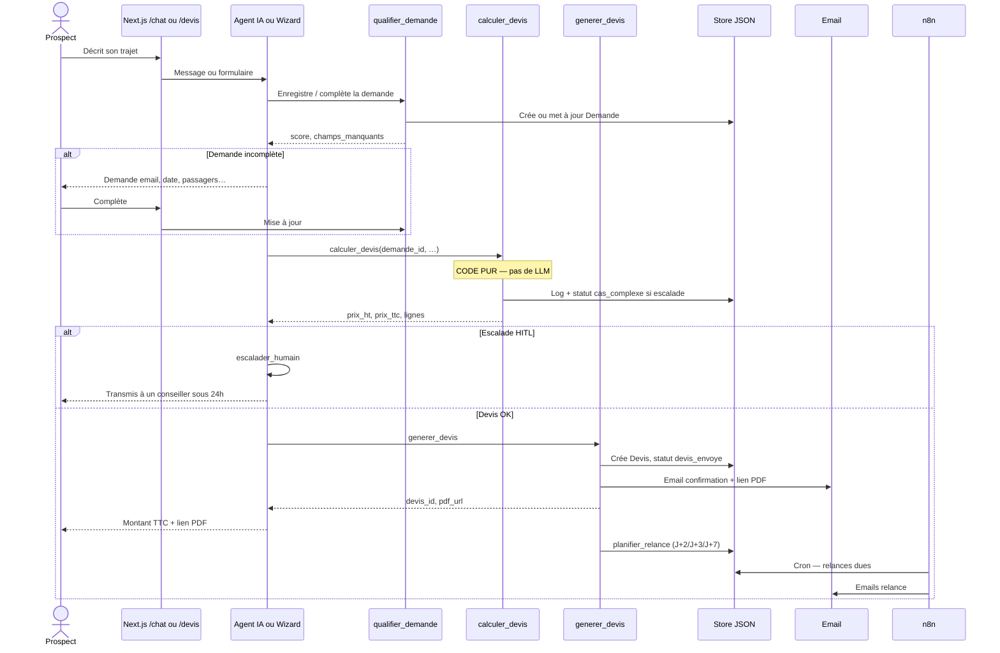
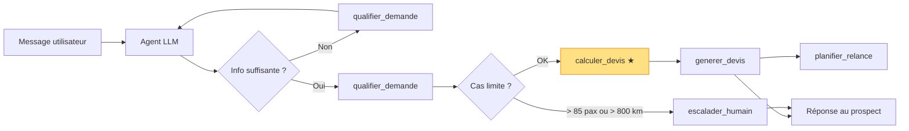
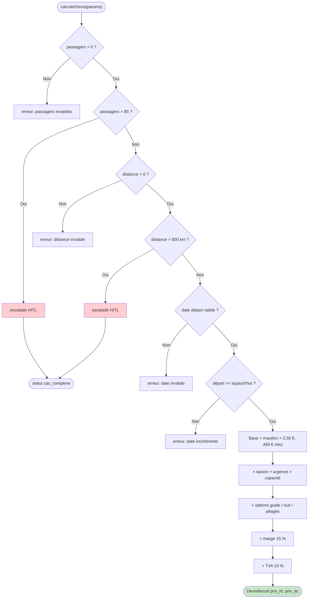
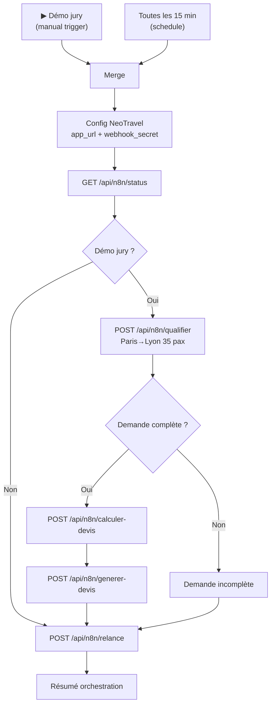
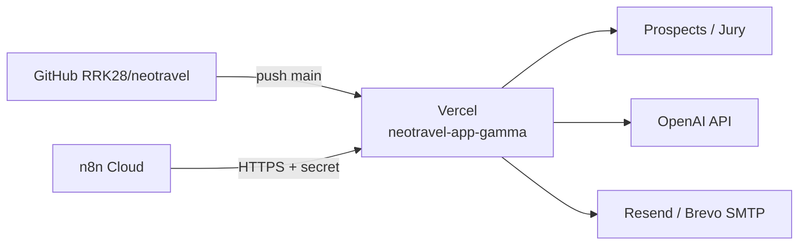

# Mode d'emploi — NeoTravel

**Projet :** L1 Data Science — Epitech 230, Groupe 16  
**Date :** juin 2026  
**Public :** équipe projet, jury de soutenance, reprise par NeoTravel / Interstellabs

---

Ce document décrit **comment le système fonctionne de bout en bout** : architecture, parcours utilisateur, agent IA, moteur tarifaire, orchestration n8n, API REST, dashboard admin, déploiement et mode secours. Il complète la [note de cadrage](note-de-cadrage.md) (vision métier) et remplace les schémas éparpillés dans le README.

**Références officielles :**
- Fiche technique Interstellabs : `NeoTravel-Fiche-Technique-Option-B.pdf` (architecture **Option B — Vercel AI SDK**)
- Code source : `neotravel-app/` + workflows `n8n/workflows/`

---

## 1. Vue d'ensemble NeoTravel

### 1.1 Le métier

NeoTravel est une plateforme d'intermédiation en transport de groupe par autocar (depuis 2010). L'entreprise **ne possède pas de flotte** : elle qualifie les besoins, sélectionne un autocariste partenaire et monte la proposition commerciale.

Le problème concret : environ **60 leads par jour**, traités manuellement par **3 à 4 personnes**. Le goulot d'étranglement n'est pas l'acquisition, c'est le **temps de traitement** (qualification, calcul tarif, relances).

### 1.2 Ce que fait notre prototype

Notre livrable automatise la **chaîne commerciale complète**, pas seulement un chatbot :

| Étape | Contenu |
|-------|---------|
| 1. Captation | Landing + chat IA **ou** formulaire guidé |
| 2. Qualification | Détection champs manquants, urgence, complexité |
| 3. Devis | Calcul automatique (code TypeScript) + PDF |
| 4. Suivi | Email de confirmation + relances planifiées |
| 5. Pilotage | Dashboard `/admin` |
| 6. Reprise humaine | Escalade sur cas limites (> 85 pax, > 800 km…) |

### 1.3 Règle d'or (à répéter en soutenance)

> **L'IA décide quoi faire. Le code exécute. Le LLM ne calcule jamais le prix.**

Seule la fonction `calculerDevis()` dans `neotravel-app/src/lib/pricing/calculer-devis.ts` produit un montant. L'agent conversationnel appelle cette fonction via l'outil `calculer_devis` — il ne doit jamais estimer ou arrondir un tarif lui-même.

### 1.4 Deux vocabulaires « Option A / B » — ne pas confondre

C'est la source de confusion la plus fréquente. Il y a **deux sens distincts** :

| Terme | Signification | Dans notre repo |
|-------|---------------|-----------------|
| **Option A (parcours utilisateur)** | Entrée principale : **chat conversationnel** | Route `/chat` — assistant IA |
| **Option B (parcours utilisateur)** | Entrée alternative : **formulaire guidé** | Route `/devis` — wizard 3 étapes, sans LLM |
| **Option B (architecture technique, fiche PDF)** | Stack retenue : **agent IA dans Next.js** via Vercel AI SDK | C'est l'architecture implémentée |
| **Option A (architecture technique, fiche PDF)** | Alternative non retenue : n8n comme « cerveau » unique | Non implémentée — n8n reste en **back-office** |

En résumé : nous avons choisi l'**architecture Option B (Vercel AI SDK)** de la fiche technique, avec le **parcours utilisateur Option A (/chat)** comme entrée principale et le **parcours Option B (/devis)** en secours.

---

## 2. Architecture technique

### 2.1 Les cinq briques du système

D'après la fiche technique officielle et notre implémentation :

| Brique | Technologie | Rôle |
|--------|-------------|------|
| Interface prospect | Next.js 15 sur Vercel | Landing, chat, formulaire devis |
| Agent IA | Vercel AI SDK | Dialogue + choix des outils métier |
| Outils métier | TypeScript | Prix, PDF, CRM, relances, escalade |
| Stockage | JSON local (`memory-store`) ou Airtable (option) | Demandes, devis, relances, logs |
| Back-office | n8n Cloud / Docker | Relances planifiées, démo jury |
| Emails | Resend ou SMTP (Brevo) | Confirmation devis + relances |
| Pilotage | Page `/admin` | KPIs et reprise manuelle |

> **Note MVP :** la fiche PDF mentionne Supabase. Pour le prototype Groupe 16, nous utilisons un **store JSON** (`neotravel-app/.data/store.json`) pour simplifier le déploiement. La migration Supabase reste possible sans changer la logique métier.

### 2.2 Schéma des couches



### 2.3 Qui fait quoi ?

| Composant | Responsabilités | Interdit |
|-----------|-----------------|----------|
| **LLM / Agent** | Dialoguer, détecter infos manquantes, choisir le prochain outil, reformuler | Calculer un prix, envoyer une offre sans passer par `calculer_devis` |
| **Tools TypeScript** | Prix exact, PDF, écriture CRM, règles tarifaires, logs | Conversation avec le prospect |
| **n8n** | Relances à date fixe, enchaînement API pour démo jury, emails automatiques | Remplacer l'agent conversationnel du chat |
| **Dashboard admin** | Visualiser le pipeline, forcer relances, reprendre un dossier | Modifier les coefficients tarifaires (→ code `matrices.ts`) |

### 2.4 Structure des dossiers clés

```
Neotravel/
├── neotravel-app/              # Application Next.js
│   ├── src/app/
│   │   ├── chat/               # Option A — parcours chat
│   │   ├── devis/              # Option B — formulaire
│   │   ├── admin/              # Dashboard
│   │   └── api/
│   │       ├── chat/           # Streaming agent IA
│   │       ├── n8n/            # API REST pour n8n
│   │       └── webhooks/relance/
│   ├── src/lib/
│   │   ├── agent/              # Prompt + tools
│   │   ├── pricing/            # calculer-devis.ts ★
│   │   ├── n8n/                # Handlers API + auth
│   │   └── db/                 # memory-store
│   └── docs/architecture.md    # Résumé technique
├── n8n/workflows/
│   └── neotravel-orchestration.json
└── docs/
    ├── mode-emploi.md          # Ce document
    └── note-de-cadrage.md      # Cadrage métier
```

---

## 3. Parcours utilisateur

### 3.1 Option principale — Chat IA (`/chat`)

C'est le parcours recommandé en démo et en production. Le prospect décrit son besoin en langage naturel ; l'agent collecte les informations et déclenche le back-office.

**Description visuelle de l'écran :**
- En-tête NeoTravel avec navigation (Accueil, Devis, Admin)
- Zone de messages style messagerie (bulles utilisateur à droite, assistant à gauche)
- Badge en haut indiquant le fournisseur LLM actif (OpenAI ou Ollama)
- Champ de saisie en bas avec bouton Envoyer

### 3.2 Option alternative — Formulaire (`/devis`)

Parcours sans LLM : wizard en 3 étapes (trajet → contact → récapitulatif). Même pipeline tarifaire (`processWizardDemande`), utile si le LLM est indisponible ou pour les utilisateurs qui préfèrent un formulaire classique.

**Description visuelle :**
- Barre de progression « Étape 1/3 »
- Sélecteurs de villes avec autocomplétion
- Calendrier pour la date de départ
- Champ nombre de passagers
- Récapitulatif avec prix TTC avant validation

### 3.3 Diagramme de séquence — parcours nominal



### 3.4 Étapes détaillées — Option A (chat)

| Étape | Action utilisateur | Comportement système |
|-------|-------------------|----------------------|
| 1 | Clique « Discuter avec l'assistant » sur `/` | Redirection vers `/chat` |
| 2 | « Devis 35 personnes Paris → Lyon le 15/07/2026, email demo@test.fr » | Parse du texte, création demande, estimation distance (~465 km) |
| 3 | (Si manque email ou date) Répond à la question | `qualifier_demande` met à jour, score complétude |
| 4 | — | `calculerDevis()` : base distance × coefficients saison/urgence/capacité + marge + TVA |
| 5 | Reçoit le montant TTC (~1 520 €) + lien PDF | `generer_devis` + email simulé ou réel |
| 6 | — | Relances planifiées ; visibles dans `/admin` |

### 3.5 Étapes détaillées — Option B (formulaire)

| Étape | Action | Système |
|-------|--------|---------|
| 1 | `/devis` → villes, date, passagers | Validation côté client |
| 2 | Coordonnées (nom, email, type client) | Création demande directe |
| 3 | Validation | `processWizardDemande` → même `calculerDevis()` |
| 4 | Page résultat | PDF téléchargeable, email, redirection admin possible |

### 3.6 Statuts du pipeline

```
nouveau → incomplet → qualifie → devis_envoye → relance_1 / relance_2
                                                      ↓
                              accepte / refuse / cloture / cas_complexe
```

| Statut | Signification |
|--------|---------------|
| `nouveau` | Demande créée, pas encore analysée |
| `incomplet` | Champs obligatoires manquants |
| `qualifie` | Prêt pour calcul devis |
| `devis_envoye` | PDF généré et envoyé |
| `relance_1` / `relance_2` | Relance email effectuée |
| `accepte` / `refuse` | Réponse prospect (manuel ou simulé) |
| `cas_complexe` | Escalade humaine (HITL) |
| `cloture` | Pas de réponse après 2 relances |

---

## 4. Agent IA et outils métier

### 4.1 Configuration de l'agent

- **Fichier prompt :** `neotravel-app/src/lib/agent/system-prompt.ts`
- **Déclaration tools :** `neotravel-app/src/lib/agent/tools.ts`
- **Route chat :** `POST /api/chat` (streaming Vercel AI SDK)
- **Mode secours :** `POST /api/chat/demo` — pipeline sans LLM (`processDemandePipeline`)

Le prompt interdit explicitement de demander la distance ou le prix au client, et impose de recopier les chiffres du back-office sans modification.

### 4.2 Table des 6 outils

| Outil | Rôle | Entrées principales | Sortie |
|-------|------|---------------------|--------|
| `qualifier_demande` | Enregistre / met à jour une demande prospect | email, villes, date, passagers… | `demande_id`, `score_completude`, `champs_manquants`, `pret_pour_devis` |
| `lookup_matrices` | Consulte les coefficients (informatif) | mois, nb_passagers, urgence | saison, capacité, urgence — **sans prix** |
| `calculer_devis` | **Seul calcul tarifaire autorisé** | demande_id, passagers, date, distance | `prix_ht`, `prix_ttc`, `lignes`, `coefficients` |
| `generer_devis` | Crée le devis + PDF + statut | demande_id, montants du calcul | `devis_id`, `pdf_url` |
| `planifier_relance` | Programme relances J+2/J+3/J+7 | demande_id, email, urgence | dates relance 1 et 2 |
| `escalader_humain` | Transfère à un commercial | demande_id, motif | statut `cas_complexe` |

### 4.3 Flux agent → tools → calculerDevis



Le nœud orange `calculer_devis` est la **seule** source de prix. Le LLM ne voit le montant qu'**après** l'exécution de cet outil.

### 4.4 Double implémentation des tools

Les mêmes opérations existent à deux endroits (volontairement) :

| Contexte | Fichier | Appelé par |
|----------|---------|------------|
| Agent chat | `src/lib/agent/tools.ts` | Vercel AI SDK |
| API n8n | `src/lib/n8n/tool-handlers.ts` | Routes `/api/n8n/*` |

Cela garantit que n8n et le chat utilisent **exactement** le même moteur `calculerDevis()`.

---

## 5. Moteur tarifaire

### 5.1 Principe

Fonction pure TypeScript : **même entrée = même prix, toujours**. Testée par un golden dataset (`calculer-devis.test.ts`).

**Fichiers :**
- `src/lib/pricing/calculer-devis.ts` — logique de calcul
- `src/lib/pricing/matrices.ts` — coefficients officiels NeoTravel
- `src/lib/pricing/estimer-trajet.ts` — distance estimée entre villes (si non fournie)

### 5.2 Entrées

- Nombre de passagers
- Date de départ + date de la demande (→ urgence)
- Distance en kilomètres
- Options : guide (+80 €/j), nuit chauffeur (+120 €/n), péages
- Nombre de jours / nuits (pour options)

### 5.3 Coefficients (extrait)

| Critère | Détail | Impact |
|---------|--------|--------|
| Saison basse | Nov, Jan, Fév, Août | −7 % |
| Saison haute | Mars, Avril, Juillet | +10 % |
| Saison très haute | Mai, Juin | +15 % |
| Urgence prioritaire | Départ < 7 j | +10 % |
| Urgence normal | — | −5 % |
| Anticipation > 90 j | — | −10 % |
| Capacité ≤ 19 pax | — | −5 % |
| Capacité 54–63 pax | — | +15 % |
| Capacité 68–85 pax | — | +40 % |
| Marge commerciale | — | +15 % |
| TVA | — | 10 % |

### 5.4 Flowchart calcul + escalade HITL



### 5.5 Exemple chiffré — Paris → Lyon, 35 pax, 15/07/2026

| Ligne | Montant indicatif |
|-------|-------------------|
| Base 465 km × 2,50 € | 1 162,50 € |
| Ajustements saison/urgence/capacité | variable |
| Marge 15 % | sur sous-total |
| TVA 10 % | sur HT |
| **TTC typique** | **~1 520 €** |

(Les montants exacts dépendent de la date de demande simulée et des coefficients du jour.)

---

## 6. Orchestration n8n

### 6.1 Rôle de n8n dans notre architecture

n8n **n'est pas** le cerveau conversationnel (contrairement à l'architecture technique « Option A » de la fiche PDF). Il sert de **back-office automatisé** :

- Exécuter la chaîne complète pour la **démo jury** (bouton manuel)
- Traiter les **relances planifiées** toutes les 15 minutes
- Prouver que le pipeline fonctionne **sans** passer par le chat

### 6.2 Workflow exporté

Fichier : `n8n/workflows/neotravel-orchestration.json`



### 6.3 Cron relances vs démo jury

| Mode | Trigger | Comportement |
|------|---------|--------------|
| **Démo jury** | Bouton « ▶ Démo jury » dans n8n | Chaîne complète : qualifier → calculer → generer → relance |
| **Production / cron** | Schedule toutes les 15 min | Uniquement `GET status` puis `POST relance` (relances dues) |

### 6.4 Délais de relance

| Type demande | 1re relance | 2e relance | Après |
|--------------|-------------|------------|-------|
| Urgente | J+2 | — | Clôturé si pas de réponse |
| Standard | J+3 | J+7 | Clôturé après 2 relances |

**Mode démo** (`DEMO_MODE=true` ou `NODE_ENV=development`) : relances à **+2 min** et **+4 min** au lieu de jours.

### 6.5 Configurer WEBHOOK_SECRET

1. **Générer un secret** (ex. `openssl rand -hex 32`)
2. **Vercel** → Project → Settings → Environment Variables → `WEBHOOK_SECRET=votre_secret`
3. **n8n Cloud** → workflow → nœud **Config NeoTravel** → remplacer `COLLER_WEBHOOK_SECRET_ICI` par la même valeur
4. Redéployer Vercel si nécessaire
5. Tester : `curl -H "x-webhook-secret: votre_secret" https://…/api/n8n/status`

Sans secret configuré côté Vercel, les routes acceptent les requêtes (mode dev). En production, un secret mismatch renvoie **401 Non autorisé**.

Guide détaillé : [`docs/n8n-cloud-setup.md`](n8n-cloud-setup.md)

---

## 7. API REST (`/api/n8n/*`)

### 7.1 Authentification

| Header | Valeur | Obligatoire |
|--------|--------|-------------|
| `x-webhook-secret` | Identique à `WEBHOOK_SECRET` (Vercel) | POST uniquement |
| `x-app-base-url` | URL publique du site (liens email/PDF) | Recommandé pour generer-devis et relance |
| `Content-Type` | `application/json` | POST |

Implémentation : `neotravel-app/src/lib/n8n/auth.ts`

### 7.2 Table des endpoints

| Méthode | Route | Body | Réponse clé |
|---------|-------|------|-------------|
| GET | `/api/n8n/status` | — | `{ ok, pending_relances, devis_count }` |
| POST | `/api/n8n/qualifier` | `{ text }` ou champs structurés | `{ demande_id, pret_pour_devis, missing }` |
| POST | `/api/n8n/calculer-devis` | `{ demande_id }` | `{ prix_ttc, prix_ht, lignes }` ou `{ cas_complexe }` |
| POST | `/api/n8n/generer-devis` | `{ demande_id }` | `{ devis_id, pdf_url, email_sent }` |
| POST | `/api/n8n/relance` | `{}` | `{ ok, traitees, results }` |

**Alias :** `POST /api/webhooks/relance` — même handler que `/api/n8n/relance`.

### 7.3 Exemple curl — qualifier

```bash
curl -X POST https://neotravel-app-gamma.vercel.app/api/n8n/qualifier \
  -H "Content-Type: application/json" \
  -H "x-webhook-secret: VOTRE_SECRET" \
  -d '{"text":"Devis 35 personnes Paris à Lyon le 15/07/2026, email demo@neotravel.test"}'
```

---

## 8. Dashboard admin

### 8.1 Accès

URL : `/admin` (ex. https://neotravel-app-gamma.vercel.app/admin)

Pas d'authentification en MVP — à ajouter en production.

### 8.2 Contenu

| Zone | Description |
|------|-------------|
| **KPIs** | Leads reçus, devis générés, relances en attente |
| **Liste demandes** | Référence, trajet, passagers, statut, urgence, date |
| **Actions** | Bouton « envoyer relances » (traitement manuel immédiat) |
| **Emails** | Indicateur Resend/SMTP configuré ou mode simulation |
| **Liens** | PDF devis, détail demande |

Rafraîchissement automatique toutes les 8 secondes.

### 8.3 KPIs alignés fiche technique

| Indicateur | Source |
|------------|--------|
| Leads reçus | `demandes.length` |
| Devis générés | `devis.length` |
| Relances en attente | relances `en_attente` avec date passée |
| Cas complexes | demandes `statut = cas_complexe` |
| Taux acceptation | acceptés / devis envoyés (si renseigné) |

---

## 9. Déploiement

### 9.1 Vercel (application)

1. Lier le repo GitHub à Vercel (racine : `neotravel-app/`)
2. Configurer les variables d'environnement (voir ci-dessous)
3. Déployer : `npm run deploy:vercel` ou push sur `main`

**Variables essentielles :**

| Variable | Usage |
|----------|-------|
| `APP_BASE_URL` | Liens dans emails et PDF |
| `LLM_PROVIDER=openai` | Chat IA en production |
| `OPENAI_API_KEY` | Clé API OpenAI |
| `WEBHOOK_SECRET` | Sécurise `/api/n8n/*` |
| `DEMO_MODE=true` | Secours sans LLM |
| `RESEND_API_KEY` ou SMTP | Emails réels |

Guide : [`neotravel-app/docs/DEPLOY-VERCEL.md`](../neotravel-app/docs/DEPLOY-VERCEL.md)

### 9.2 n8n Cloud (orchestration)

1. Compte sur https://app.n8n.cloud
2. Importer `n8n/workflows/neotravel-orchestration.json`
3. Configurer le nœud **Config NeoTravel** (URL + secret)
4. Activer le workflow

Guide : [`docs/n8n-cloud-setup.md`](n8n-cloud-setup.md)

### 9.3 Schéma déploiement



---

## 10. Mode démo / secours

### 10.1 Quand l'utiliser

- LLM indisponible (pas de clé OpenAI, Ollama arrêté)
- Réseau instable en soutenance
- Démo sans coût API

### 10.2 Activation

| Méthode | URL / config |
|---------|--------------|
| Query string | `/chat?demo=1` |
| Variable env | `DEMO_MODE=true` |
| Route API | `POST /api/chat/demo` — pipeline `processDemandePipeline` sans LLM |

Le mode démo utilise le **parseur regex** (`parseDemandeFromText`) et répond avec des messages pré-formatés. Le prix reste calculé par `calculerDevis()`.

### 10.3 Relances accélérées

En mode démo ou développement :
- Relance 1 : +2 minutes
- Relance 2 : +4 minutes

Permet de montrer le cycle complet devant le jury sans attendre plusieurs jours.

### 10.4 Fallback n8n local

```bash
docker compose up -d n8n   # http://localhost:5678
```

Importer le même workflow JSON. Utile si n8n Cloud est inaccessible.

---

## 11. FAQ soutenance

### Pourquoi deux « Option A / B » ?

- **Parcours** : A = chat, B = formulaire (deux entrées utilisateur).
- **Architecture (fiche PDF)** : B = Vercel AI SDK (notre choix), A = n8n comme cerveau (non retenu).

### L'IA calcule-t-elle le prix ?

**Non.** Toujours `calculerDevis()` en TypeScript. L'agent appelle l'outil `calculer_devis` et recopie le résultat.

### Où voir n8n dans l'interface ?

n8n est un **service séparé** (app.n8n.cloud). Il n'apparaît pas sur le site Vercel. Montrer l'onglet n8n + les logs d'exécution du workflow.

### Comment prouver la reproductibilité du prix ?

```bash
cd neotravel-app && npm run test:unit
```

Les tests `calculer-devis.test.ts` couvrent les cas limites (0 pax, > 85, dates incohérentes…).

### Que se passe-t-il si WEBHOOK_SECRET est incorrect ?

Les POST `/api/n8n/*` renvoient `401 Non autorisé`. Le workflow n8n affiche l'erreur dans le nœud « Résumé orchestration ».

### Supabase est-il utilisé ?

Pas dans le MVP Groupe 16. Store JSON local + option Airtable. La fiche PDF mentionne Supabase comme cible ; la logique métier est découplée du stockage.

### Comment simuler un cas complexe ?

Demander **90 passagers** ou un trajet **> 800 km** : le moteur renvoie `escalade: true`, statut `cas_complexe`, visible dans `/admin`.

### Quels scénarios obligatoires pour la démo ?

1. Demande complète → devis
2. Demande incomplète → questions
3. Demande urgente → majoration
4. Relance sans réponse (mode démo 2 min)
5. Cas complexe → escalade humaine

Script détaillé : [`docs/demo-soutenance.md`](demo-soutenance.md)

---

## Annexes

### A. URLs de production (Groupe 16)

| Ressource | URL |
|-----------|-----|
| Application | https://neotravel-app-gamma.vercel.app |
| Chat (Option A) | https://neotravel-app-gamma.vercel.app/chat |
| Formulaire (Option B) | https://neotravel-app-gamma.vercel.app/devis |
| Admin | https://neotravel-app-gamma.vercel.app/admin |
| Repo GitHub | https://github.com/RRK28/neotravel |

### B. Commandes utiles

```bash
# Lancer en local
cd neotravel-app && npm install && npm run dev

# Tests
npm run test:unit
npm run test:e2e

# Générer PDF de ce document
python3 scripts/md_to_pdf.py docs/mode-emploi.md docs/mode-emploi.pdf
```

### C. Documents liés

| Document | Rôle |
|----------|------|
| [note-de-cadrage.md](note-de-cadrage.md) | Vision métier, périmètre, équipe |
| [demo-soutenance.md](demo-soutenance.md) | Script démo 8–10 min |
| [n8n-cloud-setup.md](n8n-cloud-setup.md) | Configuration n8n pas à pas |
| [fiabilite.md](fiabilite.md) | HITL, RGPD, pricing |
| [cas-de-test.md](cas-de-test.md) | Jeu de tests golden |

---

*Rédigé par le Groupe 16 — Epitech 230 Master of Science, juin 2026.*
