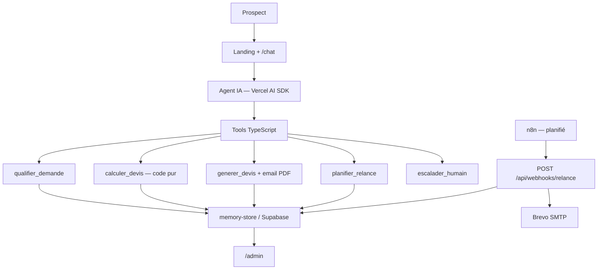
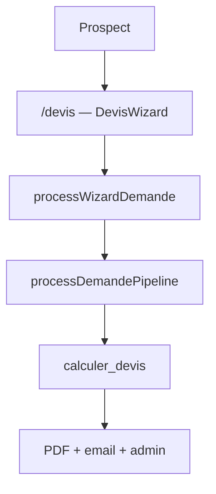

# Architecture NeoTravel — Option B (Vercel AI SDK)

Conforme à la fiche technique Interstellabs : l'agent conversationnel vit dans Next.js ; n8n gère les relances planifiées.

## Vue d'ensemble

| Brique | Technologie | Rôle |
|--------|-------------|------|
| Interface prospect | Next.js (`/`, `/chat`) | Landing + chat streaming |
| Agent IA | Vercel AI SDK (`/api/chat`) | Dialogue + choix des outils |
| Outils métier | TypeScript (`lib/agent/tools.ts`) | Prix, PDF, CRM, relances |
| Stockage | JSON local (MVP) / Supabase (cible) | Demandes, devis, relances, logs |
| Back-office | n8n | Relances automatiques à date fixe |
| Pilotage | `/admin` | Dashboard KPIs et pipeline |

**Option A vs Option B (fiche Interstellabs) :**

- **Option A** : agent porté par n8n (workflows visuels).
- **Option B (implémentée)** : agent dans Next.js via Vercel AI SDK ; n8n = relances uniquement.

Le formulaire `/devis` est un **parcours alternatif sans LLM** (même pipeline métier), pas l'« Option B » de la fiche.

## Flux principal (chat + agent)

## Parcours alternatif (formulaire `/devis`)

Pas de LLM : le wizard appelle directement le pipeline serveur.

## Rôle de n8n

**Rôle officiel (Option B) :** déclencher les relances planifiées via webhook.

| Route | Rôle |
|-------|------|
| `POST /api/webhooks/relance` | Traite les relances dues (J+2 / J+3 / J+7) |

Workflow exporté : `n8n/workflows/relance-neotravel.json`.

**Complément démo jury :** workflow d'orchestration (`n8n/workflows/neotravel-orchestration.json`) enchaîne les endpoints `/api/n8n/*` pour montrer la chaîne métier sans passer par le chat. Ce n'est pas le cœur de l'architecture Option B.

## Fournisseurs LLM

| Environnement | Configuration | Fournisseur |
|---------------|---------------|-------------|
| Local dev | `LLM_PROVIDER=ollama` + Ollama démarré | Ollama |
| Vercel prod | `LLM_PROVIDER=openai` + `OPENAI_API_KEY` | OpenAI |
| Secours | `DEMO_MODE=true` | `/api/chat/demo` (pipeline sans modèle) |

## Règle d'or

L'IA décide et dialogue ; le code exécute. Seul `calculer_devis()` produit un prix. Voir `docs/note-de-cadrage.md` (sections 7 et 8).
