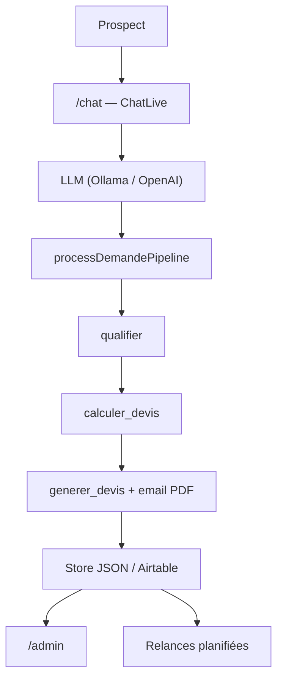
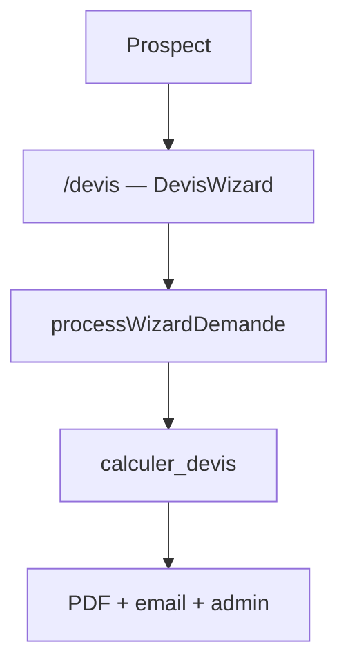
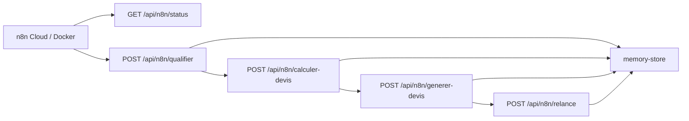

# Architecture NeoTravel — parcours Option A / Option B

## Vue d'ensemble

NeoTravel propose **deux entrées utilisateur** qui convergent vers le **même pipeline métier** :

| Parcours | Route | Rôle |
|----------|-------|------|
| **Option A** (principal) | `/chat` | Assistant conversationnel — collecte le besoin en langage naturel |
| **Option B** (alternatif) | `/devis` | Formulaire guidé en 3 étapes |

Les deux appellent le moteur `calculer_devis` (TypeScript déterministe). **Le LLM ne calcule jamais le prix.**

## Flux Option A (chat IA)

## Flux Option B (formulaire)

## Orchestration n8n (API tools)

n8n **orchestre** la même chaîne métier que l'agent, via des routes REST authentifiées (`x-webhook-secret`) :

Workflow exporté : `n8n/workflows/neotravel-orchestration.json` (démo jury + relances planifiées).

| Route | Rôle |
|-------|------|
| `GET /api/n8n/status` | Santé + relances en attente |
| `POST /api/n8n/qualifier` | Parse / crée demande, retourne score |
| `POST /api/n8n/calculer-devis` | Moteur tarifaire déterministe |
| `POST /api/n8n/generer-devis` | Devis + PDF + email |
| `POST /api/n8n/relance` | Alias `/api/webhooks/relance` |

## Fournisseurs LLM

| Environnement | Configuration | Fournisseur |
|---------------|---------------|-------------|
| Local dev | `LLM_PROVIDER=ollama` + Ollama démarré | Ollama |
| Vercel prod | `LLM_PROVIDER=openai` + `OPENAI_API_KEY` | OpenAI |
| Secours | Aucun LLM / `DEMO_MODE=true` | `/api/chat/demo` (pipeline sans modèle) |

Badge « Propulsé par IA » affiché sur la landing lorsqu'Ollama ou OpenAI est disponible.

## Règle d'or

Le system prompt et les tools de l'agent délèguent toute décision tarifaire à `calculer_devis()`. Voir `docs/note-de-cadrage.md` (section 8).
